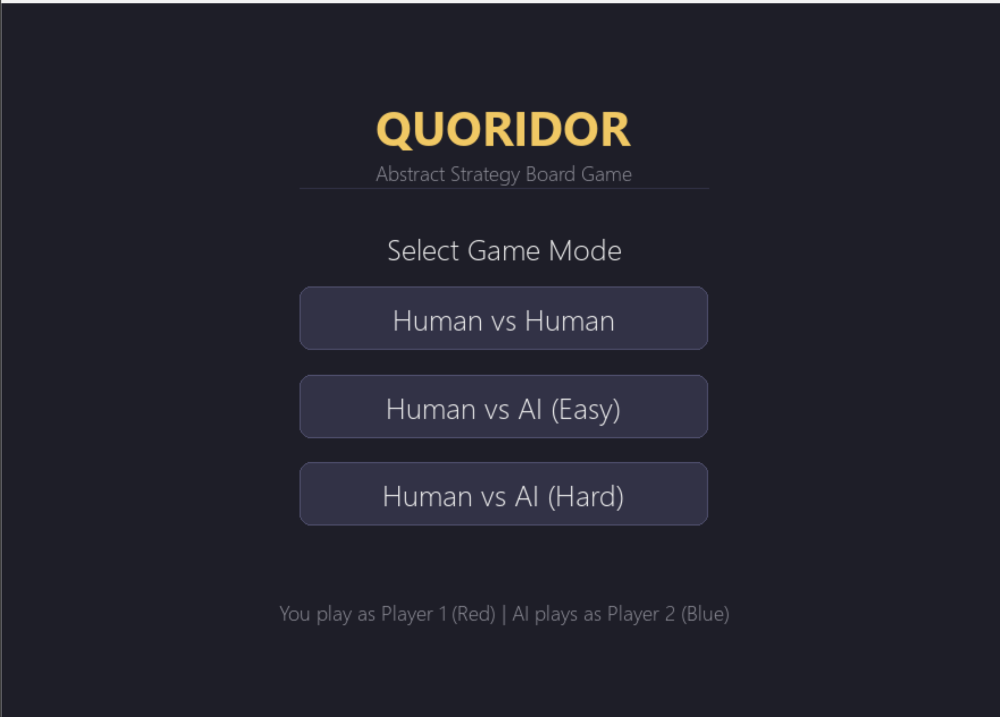
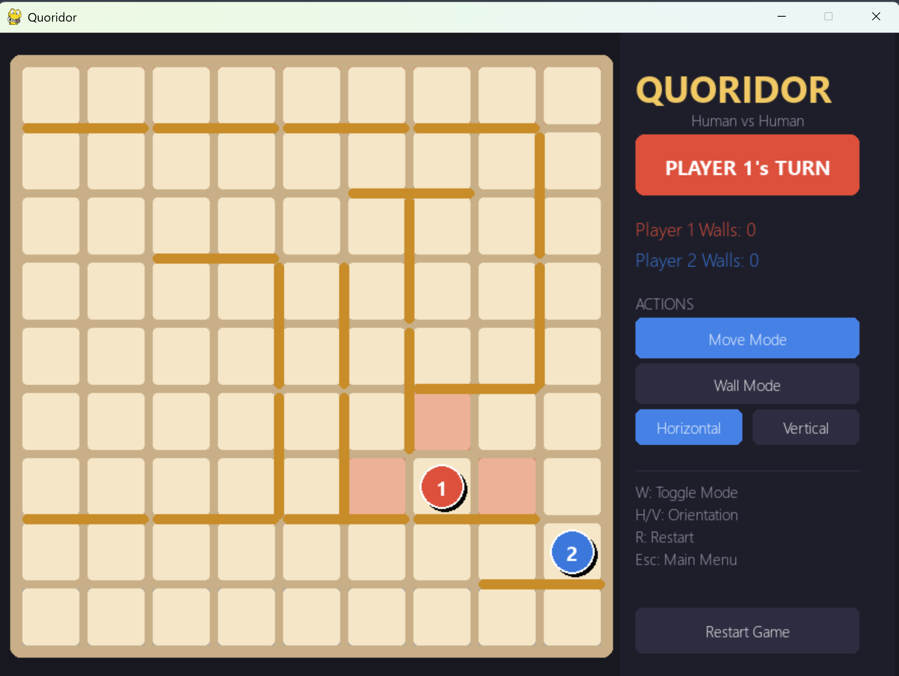
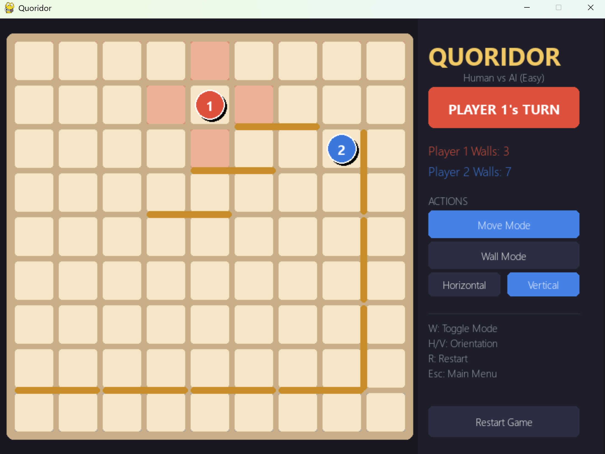
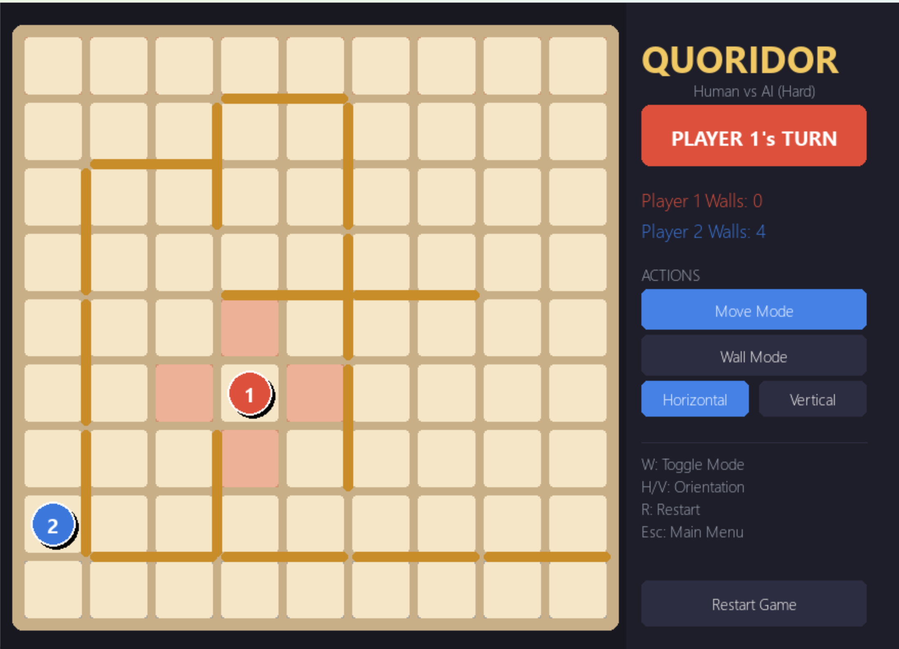

# Quoridor — Python/Pygame Implementation

A fully playable implementation of the classic two-player abstract strategy game **Quoridor**, built with Python and Pygame. Supports Human vs Human and Human vs AI modes with two AI difficulty levels.

---

## Table of Contents

- [Overview](#overview)
- [Requirements](#requirements)
- [Installation](#installation)
- [How to Run](#how-to-run)
- [How to Play](#how-to-play)
  - [Controls](#controls)
  - [Game Rules Summary](#game-rules-summary)
- [Project Structure](#project-structure)
- [AI Implementation](#ai-implementation)
  - [Easy AI](#easy-ai)
  - [Hard AI](#hard-ai)
- [Architecture Notes](#architecture-notes)

---

## Overview

Quoridor is a two-player board game played on a 9×9 grid. Each player controls one pawn. On every turn, a player either **moves their pawn** one square orthogonally or **places a wall** to impede the opponent's path. The first player to reach the opposite side of the board wins.

This implementation includes:
- Full rule enforcement (movement, wall placement, jumping, diagonal jumping)
- BFS-based wall legality check (no wall may completely block a player's path)
- Two AI opponents: Easy and Hard
- A graphical interface with move highlights, wall previews, and a live sidebar

---

## Screenshots

### Main Menu


### Human vs Human


### Human vs AI (Easy)


### Human vs AI (Hard)


## Demo Video
[Watch the demo on Google Drive](https://drive.google.com/file/d/1RN1-jKp1kxiJ3ExyV6EgCwFw-zdFC-wI/view?usp=drive_link)

## Requirements

- Python 3.10 or higher
- Pygame 2.x

Install dependencies:

```bash
pip install pygame
```

---

## Installation

```bash
git clone https://github.com/[your-repo]/quoridor.git
cd quoridor
pip install pygame
```

---

## How to Run

```bash
python main.py
```

A menu will appear. Choose one of:
- **Human vs Human** — two players share the same mouse/keyboard
- **Human vs AI (Easy)** — play against the Easy AI
- **Human vs AI (Hard)** — play against the Hard AI

You always play as **Player 1 (Red)**. The AI always plays as **Player 2 (Blue)**.

---

## How to Play

### Controls

| Input | Action |
|-------|--------|
| **Left Click** (on board cell) | Move pawn to that cell (in Move Mode) |
| **Left Click** (between cells) | Place wall at that slot (in Wall Mode) |
| **W** | Toggle between Move Mode and Wall Mode |
| **H** | Switch to Horizontal wall orientation |
| **V** | Switch to Vertical wall orientation |
| **M** | Switch back to Move Mode |
| **R** | Restart the current game |
| **Esc** | Return to the main menu |

You can also use the **sidebar buttons** on the right to switch modes and orientations.

### Game Rules Summary

- The board is 9×9. Player 1 starts at (row 8, col 4); Player 2 starts at (row 0, col 4).
- **Player 1** must reach **row 0**. **Player 2** must reach **row 8**.
- Each turn: move your pawn **or** place a wall (not both).
- Pawns move one square orthogonally. They cannot pass through walls.
- **Jump**: if the opponent's pawn is directly adjacent and the cell beyond is clear, you can jump over them.
- **Diagonal jump**: if a straight jump is blocked by a wall or board edge, you may jump diagonally instead.
- Each player starts with **10 walls**. Walls are permanent once placed.
- A wall **cannot** be placed if it would leave either player with no path to their goal.
- Walls cannot overlap or cross each other.

---

## Project Structure

```
quoridor/
├── main.py          # Entry point: game loop, menu, input handling, AI trigger
├── board.py         # Game state: positions, walls, move/wall validation, win detection
├── ai.py            # AI logic: Easy (BFS + blocking) and Hard (greedy heuristic)
├── pathfinding.py   # BFS pathfinding: wall legality checks
└── ui.py            # Pygame rendering: board, pawns, walls, sidebar, overlays
```

### `main.py`
The entry point. Renders the startup menu, then runs the main game loop. Handles all keyboard and mouse events, dispatches them to `Board` methods or `UI` helpers, and triggers AI moves after a short 400 ms delay.

### `board.py`
Contains the `Board` class, which is the single source of truth for all game state. Key data:
- `player1` / `player2` — `{row, col, walls}` dicts for each player
- `blocked_edges` — a Python `set` of edge tuples `((r1,c1),(r2,c2))` marking walls
- `placed_walls` — list of `(row, col, direction)` tuples for rendering
- `current_turn`, `mode`, `wall_orientation`, `winner`

Key methods:
- `get_valid_pawn_moves()` — returns all legal destination cells for the current player, handling normal moves, jumps, and diagonal jumps
- `can_place_wall(row, col, direction)` — validates bounds, overlap, crossing, wall count, and path connectivity
- `get_neighbors(row, col)` — returns adjacent cells not blocked by walls (used by BFS)

### `pathfinding.py`
Implements BFS in `bfs_has_path()` to check whether a player can reach their goal row. Called by `both_players_have_path()` which is used inside `can_place_wall()` to enforce the connectivity rule.

### `ai.py`
Two AI strategies, each returning a `('pawn', (row, col))` or `('wall', (row, col, direction))` tuple.

### `ui.py`
All Pygame rendering. Draws the board, cells, goal highlights, pawns, walls, wall preview (green = valid, red = invalid), sidebar, and the winner overlay. Also provides `pixel_to_cell()` and `pixel_to_wall_slot()` for translating mouse coordinates into board positions.

---

## AI Implementation

### Easy AI (`get_easy_move`)

The Easy AI combines BFS-guided movement with opportunistic wall placement:

1. **Wall placement (15% chance)**: Calls `_find_blocking_wall()` which temporarily tests candidate walls near the opponent and selects one that increases the opponent's BFS path length. Falls back to a random valid wall if none is found.
2. **Pawn movement**: Uses `_get_first_move_in_shortest_path()` to find the true next step along the BFS shortest path to goal. This means the AI correctly navigates around walls rather than greedily heading toward the goal row.

### Hard AI (`get_hard_move`)

The Hard AI evaluates all candidate actions using a greedy heuristic:

**Score = Opponent\_Path\_Length − AI\_Path\_Length**

The AI simulates every valid pawn move and every wall placement within 3 cells of either player. For each:
- Pawn moves: temporarily update the player's position, recompute AI's BFS distance, restore.
- Wall moves: temporarily add wall edges to `blocked_edges`, recompute opponent's BFS distance, restore.

The action with the highest score improvement is chosen. If no action improves the score, it falls back to moving toward the goal by row distance.

The wall search is limited to nearby positions using `_get_walls_near_players(max_distance=3)`, which dramatically reduces computation time while keeping the AI effective.

---

## Architecture Notes

**Wall storage**: Walls are stored as pairs of blocked edges (cell-to-cell pairs) in a Python `set`. This gives O(1) collision detection for both move validation and wall placement. The `_wall_edges(row, col, direction)` helper converts a wall anchor and direction into the two concrete edge tuples.

**Wall crossing**: Detected by checking whether both edges of the perpendicular wall at the same anchor already exist in `blocked_edges`. If they do, a new wall at that anchor in the opposite direction would cross, and the placement is rejected.

**No Minimax**: The Hard AI uses greedy one-ply evaluation instead of full Minimax with Alpha-Beta Pruning. This keeps the code simple, fast, and easy to understand while still producing a meaningful opponent. A Minimax extension would be a natural future improvement.
